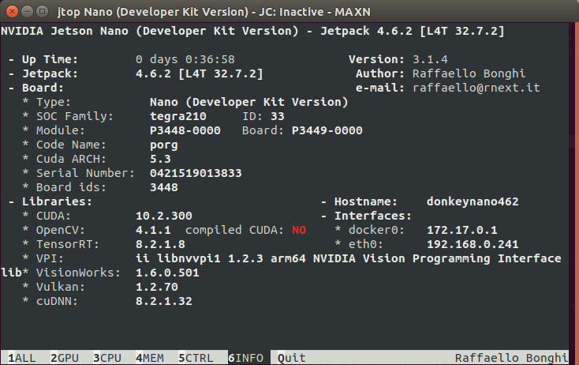

# Install donkeycar on Jetson Nano
*SD card image n9, 128GB (internal use only, just ignore), docker images taken from [naisy](https://github.com/naisy/Docker), thx a lot for the amazing work!*


## 1 SD card image [JetPack 4.6.2](https://developer.nvidia.com/embedded/jetpack-sdk-462)

- python 3.6.9 (objective: 3.7)
- OpenCV 4.1.1
- CUDA 10.2.300
- TensorRT 8.2.1.8
- cuDNN 8.2.1.32
- tensorflow >=2.2.0 [see TCIII list](https://docs.nvidia.com/deeplearning/frameworks/install-tf-jetson-platform-release-notes/tf-jetson-rel.html)

## 2 Setup 
*Actual Try: 3.2 naisy docker*
- [installation](./03-logs_naisydocker/02-input.log), [Dockerfiles](./Dockerfiles/)
- [logs](./03-logs_naisydocker/02-output.log)
- python 3.6.9
- tensorflow 2.7.0

## 3 Tests
- [x] installation
- [x] CSI & usb camera
- [x] donkey calibrate --channel 1/0 --bus 1
- [x] donkey ui (tested TubManager, Trainer)
- [x] driving: python manage.py drive 
- [x] training: python train.py  --tub=data/tub_7_22-10-15/ --model=models/jp461_m1.h5
- [x] [run pretrained models trained w/ tf 2.2](https://github.com/autorope/donkey_datasets/tree/master/circuit_launch_20210716/models)
    - [x] python manage.py drive --model=models/pilot_21-08-12_4.h5 --type=linear
    - [x] python manage.py drive --model=models/pilot_21-08-12_9.h5 --type=categorical

## 4 Try yourself
- prepare image [JetPack 4.6.2](https://developer.nvidia.com/embedded/jetpack-sdk-462)
- prepare docker & reboot
    ```
    sudo apt-get install -y docker-compose 
    sudo groupadd docker
    sudo usermod -aG docker $USER
    ```
- run docker image
    ```
    cd Docker
    ./run-jetson-jp461-donkeycar.sh*
    ```
- identify CONTAINER_ID
    ```
    docker ps -a
    ```
- login to docker container [or open a jupyter notebook in the container](http://127.0.0.1:8888/) pw: jupyter
    ```
    docker exec -it CONTAINER_ID /bin/bash
    ```
- create mycar
    ```
    donkey createcar --path=~/data/mycar
    ```
- run car (data will be persistant)
    ```
    cd ~/data/mycar
    python manage.py drive
    ```
